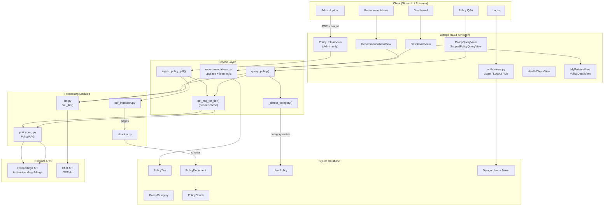

# Policy Lens — Multi-Tenant Insurance Platform Architecture

## High-Level Flow



## File Structure

```
Backend/
├── config.py                   # Models, prompts, RAG + recommendation config
├── manage.py                   # Django entry point
├── api/
│   ├── models.py               # PolicyCategory, PolicyTier, PolicyDocument,
│   │                           #   PolicyChunk, UserPolicy
│   ├── admin.py                # Django admin panel registration
│   ├── auth_views.py           # Login, Logout, CurrentUser (token auth)
│   ├── views.py                # Dashboard, MyPolicies, PolicyDetail,
│   │                           #   ScopedPolicyQuery, Recommendations,
│   │                           #   PolicyUpload, PolicyQuery
│   ├── urls.py                 # All API routes
│   ├── serializers.py          # Request/response validation
│   ├── policy_services.py      # Ingestion, category routing, scoped RAG query
│   └── management/commands/
│       └── seed_demo.py        # Seed categories, tiers, users, assignments
├── modules/
│   ├── llm.py                  # OpenAI client wrapper
│   ├── pdf_ingestion.py        # PyPDF2 text extraction
│   ├── chunker.py              # Token-based overlapping chunker
│   ├── policy_rag.py           # In-memory vector index (per-tier)
│   └── recommendations.py      # Upgrade + loan recommendation engine
├── core/
│   ├── settings.py             # Django settings (auth, sessions, DRF)
│   └── urls.py                 # Root: admin/ + api/
└── utils/
    └── similarity.py           # cosine_similarity()

Frontend/
├── app.py                      # Streamlit app (login, dashboard, chat, recs)
└── requirements.txt
```

## API Endpoints

| Method | Path | Auth | Description |
|--------|------|------|-------------|
| GET | /api/health/ | — | Health check |
| POST | /api/auth/login/ | — | Token login |
| POST | /api/auth/logout/ | Token | Logout |
| GET | /api/auth/me/ | Token | Current user info |
| GET | /api/dashboard/ | Token | User + policies + recommendation counts |
| GET | /api/my-policies/ | Token | List user's active policies |
| GET | /api/my-policies/\<id\>/ | Token | Single policy detail |
| POST | /api/my-policies/\<id\>/query/ | Token | Scoped Q&A for one policy |
| POST | /api/query/ | Token | Auto-routed Q&A across all policies |
| GET | /api/recommendations/ | Token | LLM-generated upgrade + loan suggestions |
| POST | /api/upload-policy/ | Admin | Upload PDF for a tier |

## Data Flow Summary

| Step | Admin Upload | User Query |
|------|-------------|------------|
| 1 | PDF + tier_id received | Question + optional policy scope |
| 2 | Text extracted page-by-page (PyPDF2) | Category auto-detected from keywords |
| 3 | Pages split into ~500-token chunks | Per-tier RAG index loaded (cached) |
| 4 | PolicyDocument + PolicyChunks saved to DB | Top-5 chunks retrieved by cosine similarity |
| 5 | Per-tier RAG cache invalidated | Context + history + question sent to GPT-4o |
| 6 | Response: tier, pages, chunk count | Response: answer + source references |

## Key Design Decisions

- **Per-tier RAG caching** — each tier gets its own PolicyRAG instance, rebuilt on upload
- **Category routing** — keyword detection narrows multi-policy queries to the right category
- **DB-backed chunks** — PolicyChunk model replaces the old JSON file storage
- **Token auth** — DRF TokenAuthentication for all user endpoints
- **Recommendation engine** — rule-based (tier ladder + loan eligibility) with LLM descriptions
