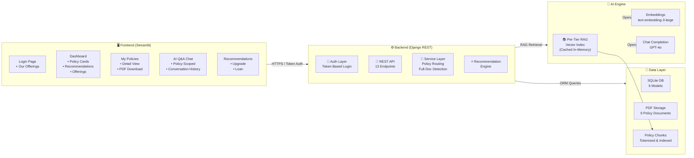
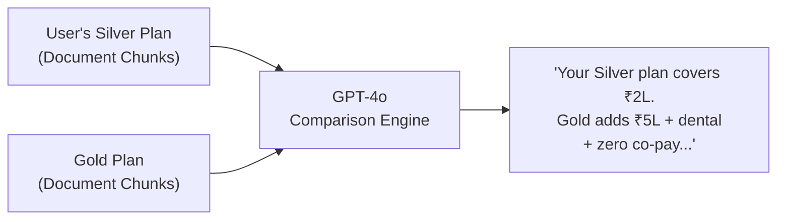
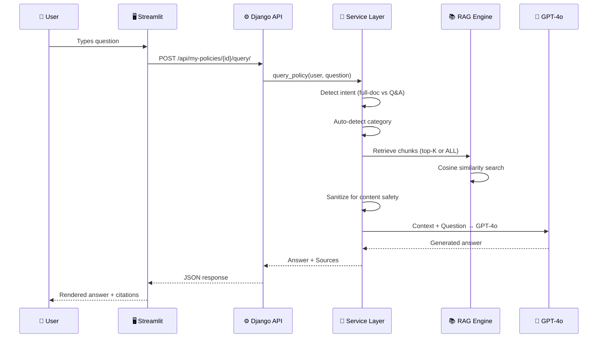
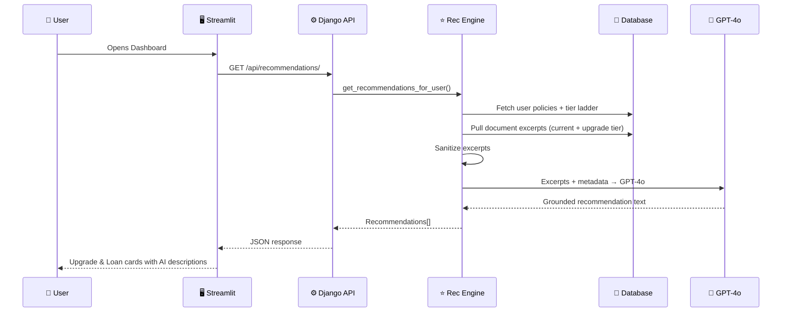
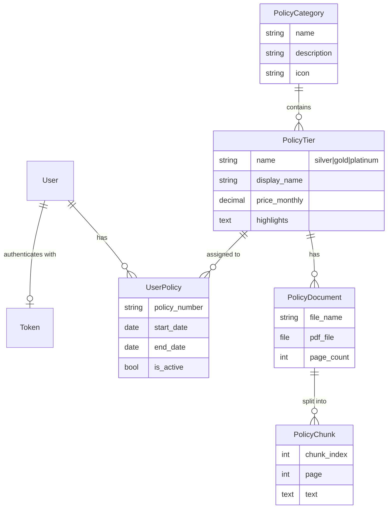

# 🔍 Policy Lens — Architecture Overview

> **AI-Powered Insurance Policy Platform** — Manage policies, get instant AI answers, and receive smart upgrade & loan recommendations grounded in actual policy documents.

---

## 🏗️ System Architecture



---

## 🌟 Key Wow Factors

### 1. 🧠 Document-Grounded AI Recommendations
> **Not just rule-based** — The system pulls actual policy document excerpts and feeds them to GPT-4o, generating recommendations that cite specific coverages, limits, and benefits from real documents.



### 2. 🔍 Smart Policy Routing
> User asks a question → system auto-detects which policy category (Car/Health/Life) is relevant and routes to the correct RAG index. No manual selection needed.

### 3. 📄 Full-Document Intelligence
> Detects when users ask for complete policy details ("Show my entire policy") and serves ALL document chunks to the LLM — not just top-K excerpts — for a comprehensive structured summary.

### 4. 🛡️ Content Safety Pipeline
> Automatic sanitization of medical/sensitive terms before LLM calls to prevent content-filter blocks, with graceful fallback to rule-based responses if the LLM is unavailable.

### 5. ⚡ Per-Tier RAG Caching
> Each policy tier gets its own in-memory vector index. Once built, queries are instant — no re-embedding on every request.

---

## 📐 Detailed Data Flow

### User Query Flow


### Recommendation Flow


---

## 🗄️ Data Model



---

## 🖥️ Frontend Pages

| Page | Key Features |
|------|-------------|
| **Login** | Hero branding, product highlights, Our Offerings grid (3 categories × 3 tiers), credentials form |
| **Dashboard** | Policy cards, inline AI recommendations (upgrade + loan), full offerings catalog |
| **My Policies** | Expandable detail cards, PDF download, "Ask about this policy" button |
| **AI Q&A** | Chat interface with conversation history, policy-scoped or auto-routed, source citations |
| **Recommendations** | UPGRADE / LOAN badges, price comparisons, document-backed reasoning |

---

## ⚙️ Backend API Endpoints

| Method | Endpoint | Auth | Purpose |
|--------|----------|------|---------|
| GET | `/api/health/` | — | Health check |
| POST | `/api/auth/login/` | — | Token login |
| POST | `/api/auth/logout/` | Token | Logout |
| GET | `/api/auth/me/` | Token | Current user |
| GET | `/api/dashboard/` | Token | Dashboard data |
| GET | `/api/my-policies/` | Token | User's policies |
| GET | `/api/my-policies/<id>/` | Token | Policy detail |
| GET | `/api/my-policies/<id>/document/` | Token | PDF download |
| POST | `/api/my-policies/<id>/query/` | Token | Scoped AI Q&A |
| POST | `/api/query/` | Token | Auto-routed AI Q&A |
| GET | `/api/recommendations/` | Token | AI recommendations |
| GET | `/api/offerings/` | — | All plans & pricing |
| POST | `/api/upload-policy/` | Admin | Upload tier PDF |

---

## 🛠️ Tech Stack

| Layer | Technology |
|-------|-----------|
| **Frontend** | Streamlit, Custom CSS, Inter font |
| **Backend** | Django 6.0, Django REST Framework |
| **Database** | SQLite (6 models) |
| **AI/ML** | OpenAI GPT-4o (chat), text-embedding-3-large (embeddings) |
| **PDF Processing** | PyPDF2 (extraction), tiktoken (chunking) |
| **RAG** | Custom in-memory vector index with cosine similarity |
| **Auth** | DRF TokenAuthentication |
| **Admin** | Django Admin panel |

---

## 📁 Project Structure

```
ai_hackathon/
├── Backend/
│   ├── config.py                    # Models, prompts, RAG config
│   ├── manage.py
│   ├── api/
│   │   ├── models.py                # 6 Django models
│   │   ├── views.py                 # 9 API views
│   │   ├── auth_views.py            # Login/Logout/Me
│   │   ├── serializers.py           # Request validation
│   │   ├── policy_services.py       # Core logic: ingest, query, routing
│   │   ├── urls.py                  # 13 endpoints
│   │   ├── admin.py                 # Admin panel config
│   │   └── management/commands/
│   │       ├── seed_demo.py         # Demo data seeder
│   │       └── upload_policies.py   # Bulk PDF uploader
│   ├── modules/
│   │   ├── llm.py                   # OpenAI client wrapper
│   │   ├── pdf_ingestion.py         # PDF → text extraction
│   │   ├── chunker.py              # Token-based overlapping chunker
│   │   ├── policy_rag.py           # Per-tier vector index
│   │   └── recommendations.py      # Upgrade + loan engine with doc excerpts
│   ├── core/
│   │   ├── settings.py              # Django config
│   │   └── urls.py                  # Root routing
│   └── utils/
│       └── similarity.py            # Cosine similarity
├── Frontend/
│   ├── app.py                       # Full Streamlit app (5 pages, custom CSS)
│   └── requirements.txt
└── Policy Plan/                     # Source PDFs (9 documents)
    ├── Vehicle Insurance/           # Silver, Gold, Platinum
    ├── Health Insurance/            # Silver, Gold, Platinum
    └── Life Insurance/              # Silver, Gold, Platinum
```

---

## 📊 Demo Users

| User | Password | Policies | Recommendations |
|------|----------|----------|-----------------|
| **swarnali** | swarnali123 | Car Gold, Health Silver | Car → Platinum, Health → Gold, Car Loan |
| **aritro** | aritro123 | Car Silver, Life Gold | Car → Gold, Life → Platinum, Life Loan |

---

## 🔑 What Makes This Different

| Feature | Traditional Approach | Policy Lens |
|---------|---------------------|-------------|
| **Recommendations** | Generic "upgrade now" messages | AI compares actual plan documents, cites specific benefits |
| **Policy Q&A** | FAQ page or call center | RAG-powered instant answers from your actual policy PDF |
| **Full Document View** | Download and read 10+ page PDF | AI detects intent, summarizes entire policy in structured format |
| **Multi-Policy Routing** | User must select which policy | Auto-detects category from question keywords |
| **Content Safety** | Crashes on blocked content | Auto-sanitizes + graceful fallback to rule-based responses |
